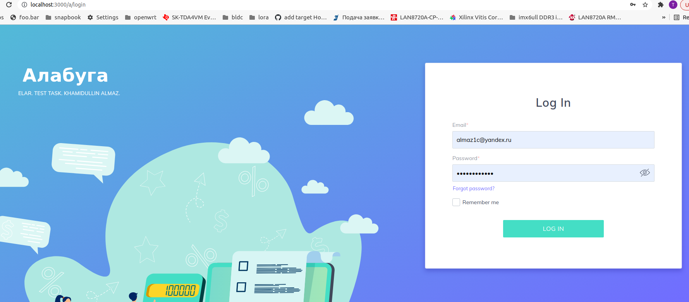
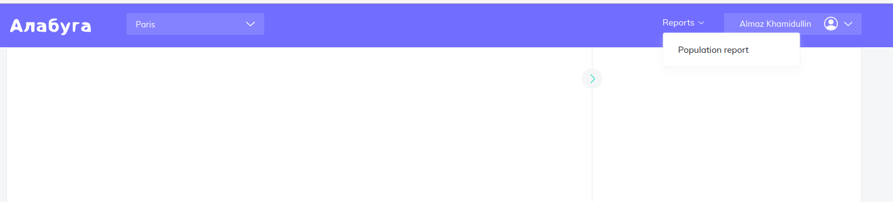
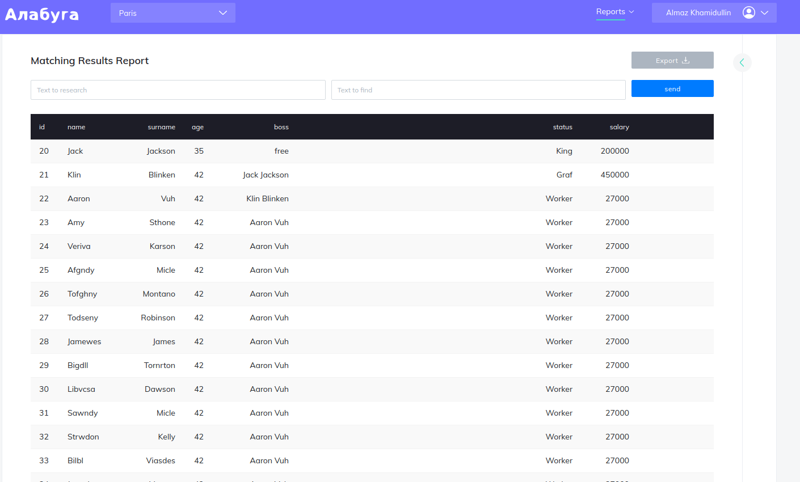

## Getting started without Docker

On first setup install all necessary dependencies using:

```
$ yarn install
```

you need to run this command just once after cloning repo.

To run the application

```
$ yarn start
```

## Getting started using Docker

On first running:

```
$ docker-compose up -d
```

Then check if docker container is started:
```
$ docker ps 
... schlumberger_frontend_1
```
here `schlumberger_frontend_1` is name of container

To stop container use:
```
$ docker stop schlumberger_frontend_1
```

To run it again use:
```
$ docker start schlumberger_frontend_1
```

## User guide

check if FE serivce is running:

```
$ docker logs schlumberger_frontend_1
```
if no error messages you should be able to open following URL address in your browser:
```
http://localhost:3000/a/login
```

Here what you should see:

enter `almaz1c@yandex.ru` as a login address and `Maggie123!2,` as password then press `LOG IN` button.
that user pre-generated in BE migrations to simplify testing.

here what you should see after login:


select client company in top left drop out and select `Population Report` in top right drop out:


you should see population of city showing name, surname, age, salary, status and current boss of the person.


## Some explanation

user login/password and citizens report pre-generated by migrations.
Used stack: `Flask`, `SQL-Alchemy`, `Alembic`, `PostgreSQL` on `BE` side.
ReactJS and Redux on `FE` side.